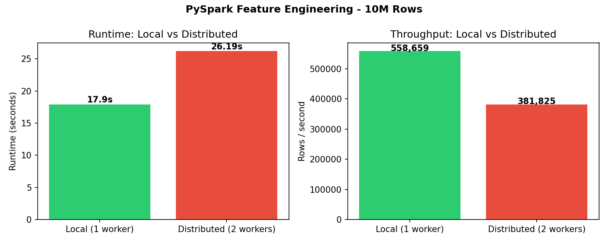

# Milestone 4 Report

## 1. Performance Comparison

| Metric          | Local (1 worker) | Distributed (2 workers) |
|-----------------|-----------------|------------------------|
| Total Runtime   | 17.9s           | 26.19s                 |
| Shuffle Volume  | N/A             | Multiple stages (groupBy + join) |
| Peak Memory     | 434.4 MiB       | 127.2 MiB per executor |
| Partitions Used | 10              | 20                     |
| Rows Processed  | 10,000,000      | 10,000,000             |
| Throughput      | 558,659 rows/s  | 382,206 rows/s         |



### Bottleneck Identification
The groupBy/join on user_id was the dominant bottleneck, generating the most 
shuffle traffic. With 100,000 unique user IDs, all records per user must be 
co-located on the same executor before aggregation can proceed — this requires 
a full shuffle across partitions. In the distributed run, this shuffle also 
required network transfer between executor 0 (172.18.0.4) and executor 1 
(172.18.0.3), visible in the ShuffleMapStage completions in the job logs.

## 2. Architecture Analysis

### Reliability Trade-offs
PySpark handles worker failures via DAG lineage replay — if a task fails,
Spark re-runs only that partition on another executor using the original 
parquet files as the source of truth. In our 2-worker cluster, if one worker 
crashed mid-job, Spark would reassign its tasks to the surviving worker 
automatically. Spill-to-disk occurs when executor memory is exhausted during 
shuffles — with only 512MB per executor, large groupBy operations on high 
cardinality keys risk spilling, which increases I/O latency but prevents OOM 
crashes. Speculative execution can launch backup copies of slow-running tasks, 
reducing tail latency at the cost of extra compute.

### When Distributed Processing Helps vs. Hurts
Our results show that for this 10M row dataset (~100MB parquet), local execution 
was faster (17.9s) than distributed (26.19s). This is because each worker has 
only 1 core and 512MB RAM — the coordination overhead of task scheduling, shuffle 
coordination, and network transfer between executors exceeded the benefit of 
parallelism. For datasets under ~1GB on a small cluster, single-machine execution 
is faster because distributed overhead outweighs the parallelism benefit. The 
crossover point where distributed becomes beneficial was not reached with this 
configuration. At 1B+ rows, or with a larger cluster (8+ cores per worker), 
distributed processing would provide meaningful speedups — each additional worker 
reduces runtime roughly linearly until network/shuffle becomes the bottleneck.

### Cost Implications
In our experiment, the distributed run used 2x the compute resources but 
produced slower results — making it strictly less cost-efficient than local 
execution at this scale. Doubling workers roughly halves wall-clock time only 
when the workload is large enough to saturate all cores. Network costs from 
shuffle data transfer between workers add up at scale. For a 10M row job like 
ours, local execution is cheapest. At 1B+ rows, distributed processing on 
spot/preemptible instances becomes cost-effective because the wall-clock time 
reduction outweighs the added compute cost.

### Production Recommendations
- Target partition size of 128–256MB for balanced task granularity
- Set spark.sql.shuffle.partitions = 2–3× number of cores
- Use Parquet with Snappy compression for columnar reads (already implemented)
- Cache intermediate DataFrames that are reused across multiple actions
- Monitor shuffle spill metrics — excessive spill indicates under-provisioned memory
- Enable adaptive query execution (`spark.sql.adaptive.enabled=true`) to 
  automatically optimize partition counts at runtime
- Consider broadcasting small DataFrames in joins to eliminate shuffle entirely

## 3. Reproducibility

Data was generated with a fixed seed for deterministic output:
```bash
docker exec spark-master python3 /opt/spark/apps/generate_data.py \
  --rows 10000000 --seed 42 --output /opt/spark/apps/data/
```

Verification hash (first 10,000 rows, seed=42): `12014c7a4e5ba920`

Re-running with `--seed 42` produces identical output confirmed by matching 
verification hashes across independent runs.

## 4. Cluster Configuration

| Component          | Configuration              |
|--------------------|---------------------------|
| Spark Version      | 3.4.0                     |
| Master             | spark://spark-master:7077 |
| Workers            | 2                         |
| Cores per worker   | 1                         |
| Memory per worker  | 1GB (512MB executor)      |
| Data format        | Parquet (Snappy)          |
| Dataset size       | 10,000,000 rows           |